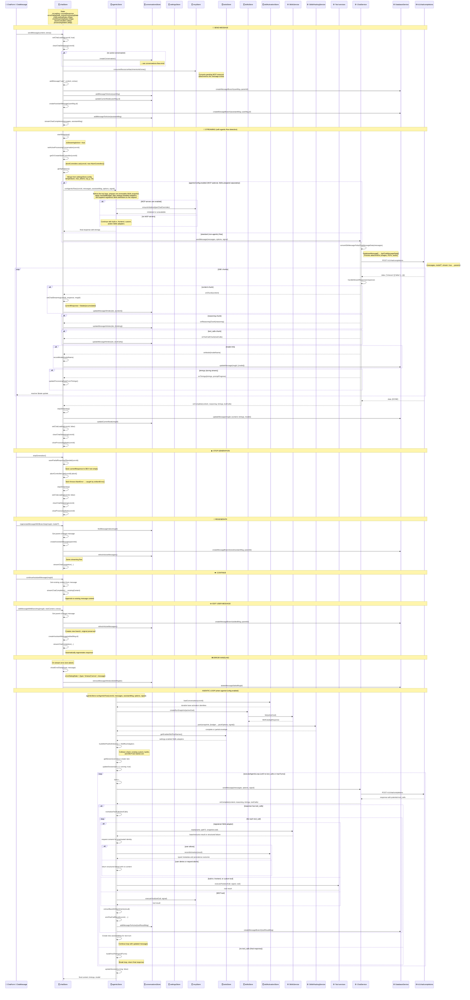

```mermaid
sequenceDiagram
    participant UI as 🧩 ChatForm / ChatMessage
    participant chatStore as 🗄️ chatStore
    participant agenticStore as 🗄️ agenticStore
    participant convStore as 🗄️ conversationsStore
    participant settingsStore as 🗄️ settingsStore
    participant mcpStore as 🗄️ mcpStore
    participant toolsStore as 🗄️ toolsStore
    participant skillsStore as 🗄️ skillsStore
    participant activationStore as 🗄️ skillActivationStore
    participant SkillsSvc as ⚙️ SkillsService
    participant PackingSvc as ⚙️ SkillsPackingService
    participant ToolsSvc as ⚙️ Tool services
    participant ChatSvc as ⚙️ ChatService
    participant DbSvc as ⚙️ DatabaseService
    participant API as 🌐 /v1/chat/completions

    Note over chatStore: State:<br/>isLoading, currentResponse<br/>errorDialogState, activeProcessingState<br/>chatLoadingStates (Map)<br/>chatStreamingStates (Map)<br/>abortControllers (Map)<br/>processingStates (Map)

    %% ═══════════════════════════════════════════════════════════════════════════
    Note over UI,API: 💬 SEND MESSAGE
    %% ═══════════════════════════════════════════════════════════════════════════

    UI->>chatStore: sendMessage(content, extras)
    activate chatStore

    chatStore->>chatStore: setChatLoading(convId, true)
    chatStore->>chatStore: clearChatStreaming(convId)

    alt no active conversation
        chatStore->>convStore: createConversation()
        Note over convStore: → see conversations-flow.mmd
    end

    chatStore->>mcpStore: consumeResourceAttachmentsAsExtras()
    Note right of mcpStore: Converts pending MCP resource<br/>attachments into message extras

    chatStore->>chatStore: addMessage("user", content, extras)
    chatStore->>DbSvc: createMessageBranch(userMsg, parentId)
    chatStore->>convStore: addMessageToActive(userMsg)
    chatStore->>convStore: updateCurrentNode(userMsg.id)

    chatStore->>chatStore: createAssistantMessage(userMsg.id)
    chatStore->>DbSvc: createMessageBranch(assistantMsg, userMsg.id)
    chatStore->>convStore: addMessageToActive(assistantMsg)

    chatStore->>chatStore: streamChatCompletion(messages, assistantMsg)
    deactivate chatStore

    %% ═══════════════════════════════════════════════════════════════════════════
    Note over UI,API: 🌊 STREAMING (with agentic flow detection)
    %% ═══════════════════════════════════════════════════════════════════════════

    activate chatStore
    chatStore->>chatStore: startStreaming()
    Note right of chatStore: isStreamingActive = true

    chatStore->>chatStore: setActiveProcessingConversation(convId)
    chatStore->>chatStore: getOrCreateAbortController(convId)
    Note right of chatStore: abortControllers.set(convId, new AbortController())

    chatStore->>chatStore: getApiOptions()
    Note right of chatStore: Merge from settingsStore.config:<br/>temperature, max_tokens, top_p, etc.

    alt agenticConfig.enabled (MCP optional, Skills prepared separately)
        chatStore->>agenticStore: runAgenticFlow(convId, messages, assistantMsg, options, signal)
        Note over agenticStore: Before the tool loop, prepare one immutable Skills snapshot,<br/>apply maxSkillBudget, filter settings-disabled adapters,<br/>and append registered Skills definitions to the request
        alt MCP servers are enabled
            agenticStore->>mcpStore: ensureInitialized(perChatOverrides)
            mcpStore-->>agenticStore: initialized or unavailable
        else no MCP servers
            Note over agenticStore: Continue with built-in, frontend, custom,<br/>and/or Skills adapters
        end
        agenticStore-->>chatStore: final response with timings
    else standard (non-agentic) flow
        chatStore->>ChatSvc: sendMessage(messages, options, signal)
    end

    activate ChatSvc

    ChatSvc->>ChatSvc: convertDbMessageToApiChatMessageData(messages)
    Note right of ChatSvc: DatabaseMessage[] → ApiChatMessageData[]<br/>Process attachments (images, PDFs, audio)

    ChatSvc->>API: POST /v1/chat/completions
    Note right of API: {messages, model?, stream: true, ...params}

    loop SSE chunks
        API-->>ChatSvc: data: {"choices":[{"delta":{...}}]}
        ChatSvc->>ChatSvc: handleStreamResponse(response)

        alt content chunk
            ChatSvc-->>chatStore: onChunk(content)
            chatStore->>chatStore: setChatStreaming(convId, response, msgId)
            Note right of chatStore: currentResponse = $state(accumulated)
            chatStore->>convStore: updateMessageAtIndex(idx, {content})
        end

        alt reasoning chunk
            ChatSvc-->>chatStore: onReasoningChunk(reasoning)
            chatStore->>convStore: updateMessageAtIndex(idx, {thinking})
        end

        alt tool_calls chunk
            ChatSvc-->>chatStore: onToolCallChunk(toolCalls)
            chatStore->>convStore: updateMessageAtIndex(idx, {toolCalls})
        end

        alt model info
            ChatSvc-->>chatStore: onModel(modelName)
            chatStore->>chatStore: recordModel(modelName)
            chatStore->>DbSvc: updateMessage(msgId, {model})
        end

        alt timings (during stream)
            ChatSvc-->>chatStore: onTimings(timings, promptProgress)
            chatStore->>chatStore: updateProcessingStateFromTimings()
        end

        chatStore-->>UI: reactive $state update
    end

    API-->>ChatSvc: data: [DONE]
    ChatSvc-->>chatStore: onComplete(content, reasoning, timings, toolCalls)
    deactivate ChatSvc

    chatStore->>chatStore: stopStreaming()
    chatStore->>DbSvc: updateMessage(msgId, {content, timings, model})
    chatStore->>convStore: updateCurrentNode(msgId)
    chatStore->>chatStore: setChatLoading(convId, false)
    chatStore->>chatStore: clearChatStreaming(convId)
    chatStore->>chatStore: clearProcessingState(convId)
    deactivate chatStore

    %% ═══════════════════════════════════════════════════════════════════════════
    Note over UI,API: ⏹️ STOP GENERATION
    %% ═══════════════════════════════════════════════════════════════════════════

    UI->>chatStore: stopGeneration()
    activate chatStore
    chatStore->>chatStore: savePartialResponseIfNeeded(convId)
    Note right of chatStore: Save currentResponse to DB if non-empty
    chatStore->>chatStore: abortControllers.get(convId).abort()
    Note right of chatStore: fetch throws AbortError → caught by isAbortError()
    chatStore->>chatStore: stopStreaming()
    chatStore->>chatStore: setChatLoading(convId, false)
    chatStore->>chatStore: clearChatStreaming(convId)
    chatStore->>chatStore: clearProcessingState(convId)
    deactivate chatStore

    %% ═══════════════════════════════════════════════════════════════════════════
    Note over UI,API: 🔁 REGENERATE
    %% ═══════════════════════════════════════════════════════════════════════════

    UI->>chatStore: regenerateMessageWithBranching(msgId, model?)
    activate chatStore
    chatStore->>convStore: findMessageIndex(msgId)
    chatStore->>chatStore: Get parent of target message
    chatStore->>chatStore: createAssistantMessage(parentId)
    chatStore->>DbSvc: createMessageBranch(newAssistantMsg, parentId)
    chatStore->>convStore: refreshActiveMessages()
    Note right of chatStore: Same streaming flow
    chatStore->>chatStore: streamChatCompletion(...)
    deactivate chatStore

    %% ═══════════════════════════════════════════════════════════════════════════
    Note over UI,API: ➡️ CONTINUE
    %% ═══════════════════════════════════════════════════════════════════════════

    UI->>chatStore: continueAssistantMessage(msgId)
    activate chatStore
    chatStore->>chatStore: Get existing content from message
    chatStore->>chatStore: streamChatCompletion(..., existingContent)
    Note right of chatStore: Appends to existing message content
    deactivate chatStore

    %% ═══════════════════════════════════════════════════════════════════════════
    Note over UI,API: ✏️ EDIT USER MESSAGE
    %% ═══════════════════════════════════════════════════════════════════════════

    UI->>chatStore: editMessageWithBranching(msgId, newContent, extras)
    activate chatStore
    chatStore->>chatStore: Get parent of target message
    chatStore->>DbSvc: createMessageBranch(editedMsg, parentId)
    chatStore->>convStore: refreshActiveMessages()
    Note right of chatStore: Creates new branch, original preserved
    chatStore->>chatStore: createAssistantMessage(editedMsg.id)
    chatStore->>chatStore: streamChatCompletion(...)
    Note right of chatStore: Automatically regenerates response
    deactivate chatStore

    %% ═══════════════════════════════════════════════════════════════════════════
    Note over UI,API: ❌ ERROR HANDLING
    %% ═══════════════════════════════════════════════════════════════════════════

    Note over chatStore: On stream error (non-abort):
    chatStore->>chatStore: showErrorDialog(type, message)
    Note right of chatStore: errorDialogState = {type: 'timeout'|'server', message}
    chatStore->>convStore: removeMessageAtIndex(failedMsgIdx)
    chatStore->>DbSvc: deleteMessage(failedMsgId)

    %% ═══════════════════════════════════════════════════════════════════════════
    Note over UI,API: AGENTIC LOOP (when agenticConfig.enabled)

    Note over agenticStore: agenticStore.runAgenticFlow(convId, messages, assistantMsg, options, signal)
    activate agenticStore
    agenticStore->>activationStore: loadConversation(convId)
    activationStore-->>agenticStore: durable base activation identities
    agenticStore->>skillsStore: createRunSnapshot(activeCwd)
    skillsStore->>SkillsSvc: list(activeCwd)
    SkillsSvc-->>skillsStore: SkillCatalogResponse
    agenticStore->>PackingSvc: pack(snapshot, {budget, ...packOptions, signal})
    PackingSvc-->>agenticStore: complete or partial envelope
    agenticStore->>toolsStore: getEnabledSkillToolNames()
    toolsStore-->>agenticStore: settings-enabled Skills adapters
    agenticStore->>agenticStore: buildSkillToolDefinitions() -> SkillRunAdapters
    Note right of agenticStore: Collision check: existing custom, builtin,<br/>and MCP tool names win
    agenticStore->>agenticStore: getSession(convId) or create new
    agenticStore->>agenticStore: updateSession(turn: 0, running: true)

    loop executeAgenticLoop (until no tool_calls or maxTurns)
        agenticStore->>agenticStore: turn++
        agenticStore->>ChatSvc: sendMessage(messages, options, signal)
        ChatSvc->>API: POST /v1/chat/completions
        API-->>ChatSvc: response with potential tool_calls
        ChatSvc-->>agenticStore: onComplete(content, reasoning, timings, toolCalls)

        alt response has tool_calls
            agenticStore->>agenticStore: normalizeToolCalls(toolCalls)
            loop for each tool_call
                alt registered Skills adapter
                    agenticStore->>SkillsSvc: read({name, path?}, snapshot.cwd)
                    SkillsSvc-->>agenticStore: base/resource result or structured failure
                    agenticStore->>agenticStore: request consent for unactivated identity
                    alt user allows
                        agenticStore->>activationStore: recordActivation(result)
                        activationStore-->>agenticStore: typed metadata and persistence outcome
                    else user denies or request aborts
                        agenticStore->>agenticStore: return structured denial with no content
                    end
                else built-in, frontend, or custom tool
                    agenticStore->>ToolsSvc: executeTool(toolCall, signal, cwd)
                    ToolsSvc-->>agenticStore: tool result
                else MCP tool
                    agenticStore->>mcpStore: executeTool(toolCall, signal)
                    mcpStore-->>agenticStore: tool result
                end
                agenticStore->>agenticStore: extractBase64Attachments(result)
                agenticStore->>agenticStore: emitToolCallResult(convId, ...)
                agenticStore->>convStore: addMessageToActive(toolResultMsg)
                agenticStore->>DbSvc: createMessageBranch(toolResultMsg)
            end
            agenticStore->>agenticStore: Create new assistantMsg for next turn
            Note right of agenticStore: Continue loop with updated messages
        else no tool_calls (final response)
            agenticStore->>agenticStore: buildFinalTimings(allTurns)
            Note right of agenticStore: Break loop, return final response
        end
    end

    agenticStore->>agenticStore: updateSession(running: false)
    agenticStore-->>chatStore: final content, timings, model
    deactivate agenticStore
```
