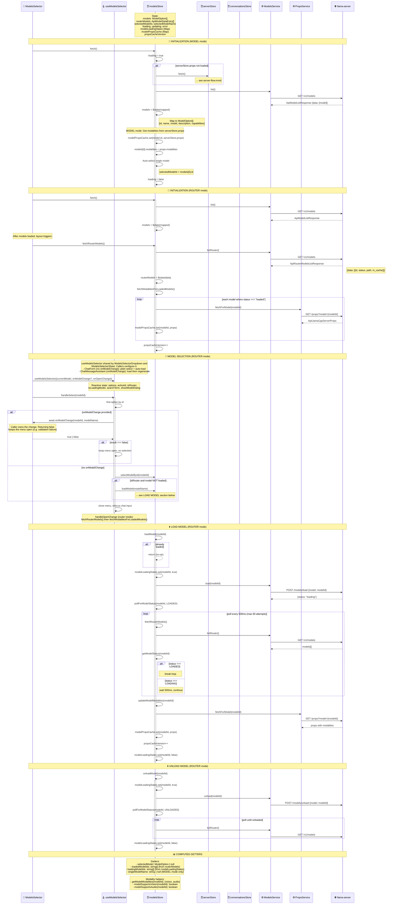

```mermaid
sequenceDiagram
    participant UI as 🧩 ModelsSelector
    participant Hooks as 🪝 useModelsSelector
    participant modelsStore as 🗄️ modelsStore
    participant serverStore as 🗄️ serverStore
    participant convStore as 🗄️ conversationsStore
    participant ModelsSvc as ⚙️ ModelsService
    participant PropsSvc as ⚙️ PropsService
    participant API as 🌐 llama-server

    Note over modelsStore: State:<br/>models: ModelOption[]<br/>routerModels: ApiModelDataEntry[]<br/>selectedModelId, selectedModelName<br/>loading, updating, error<br/>modelLoadingStates (Map)<br/>modelPropsCache (Map)<br/>propsCacheVersion

    %% ═══════════════════════════════════════════════════════════════════════════
    Note over UI,API: 🚀 INITIALIZATION (MODEL mode)
    %% ═══════════════════════════════════════════════════════════════════════════

    UI->>modelsStore: fetch()
    activate modelsStore
    modelsStore->>modelsStore: loading = true

    alt serverStore.props not loaded
        modelsStore->>serverStore: fetch()
        Note over serverStore: → see server-flow.mmd
    end

    modelsStore->>ModelsSvc: list()
    ModelsSvc->>API: GET /v1/models
    API-->>ModelsSvc: ApiModelListResponse {data: [model]}

    modelsStore->>modelsStore: models = $state(mapped)
    Note right of modelsStore: Map to ModelOption[]:<br/>{id, name, model, description, capabilities}

    Note over modelsStore: MODEL mode: Get modalities from serverStore.props
    modelsStore->>modelsStore: modelPropsCache.set(model.id, serverStore.props)
    modelsStore->>modelsStore: models[0].modalities = props.modalities

    modelsStore->>modelsStore: Auto-select single model
    Note right of modelsStore: selectedModelId = models[0].id
    modelsStore->>modelsStore: loading = false
    deactivate modelsStore

    %% ═══════════════════════════════════════════════════════════════════════════
    Note over UI,API: 🚀 INITIALIZATION (ROUTER mode)
    %% ═══════════════════════════════════════════════════════════════════════════

    UI->>modelsStore: fetch()
    activate modelsStore
    modelsStore->>ModelsSvc: list()
    ModelsSvc->>API: GET /v1/models
    API-->>ModelsSvc: ApiModelListResponse
    modelsStore->>modelsStore: models = $state(mapped)
    deactivate modelsStore

    Note over UI: After models loaded, layout triggers:
    UI->>modelsStore: fetchRouterModels()
    activate modelsStore
    modelsStore->>ModelsSvc: listRouter()
    ModelsSvc->>API: GET /v1/models
    API-->>ModelsSvc: ApiRouterModelsListResponse
    Note right of API: {data: [{id, status, path, in_cache}]}
    modelsStore->>modelsStore: routerModels = $state(data)

    modelsStore->>modelsStore: fetchModalitiesForLoadedModels()
    loop each model where status === "loaded"
        modelsStore->>PropsSvc: fetchForModel(modelId)
        PropsSvc->>API: GET /props?model={modelId}
        API-->>PropsSvc: ApiLlamaCppServerProps
        modelsStore->>modelsStore: modelPropsCache.set(modelId, props)
    end
    modelsStore->>modelsStore: propsCacheVersion++
    deactivate modelsStore

    %% ═══════════════════════════════════════════════════════════════════════════
    Note over UI,API: 🔄 MODEL SELECTION (ROUTER mode)
    %% ═══════════════════════════════════════════════════════════════════════════

    Note over Hooks: useModelsSelector shared by ModelsSelectorDropdown and<br/>ModelsSelectorSheet. Callers configure it:<br/>- ChatForm (no onModelChange): plain select + auto-load<br/>- ChatMessageAssistant (onModelChange): load then regenerate

    UI->>Hooks: useModelsSelector({currentModel, onModelChange?, onOpenChange})
    Note over Hooks: Reactive state: options, activeId, isRouter,<br/>isLoadingModel, searchTerm, showModelDialog

    UI->>Hooks: handleSelect(modelId)
    activate Hooks
    Hooks->>Hooks: find option by id

    alt onModelChange provided
        Hooks->>UI: await onModelChange(modelId, modelName)
        Note over UI: Caller owns the change. Returning false<br/>keeps the menu open (e.g. validation failure)
        UI-->>Hooks: true | false
        alt result === false
            Hooks->>Hooks: keep menu open, no selection
        end
    else no onModelChange
        Hooks->>modelsStore: selectModelById(modelId)
        alt isRouter and model NOT loaded
            Hooks->>modelsStore: loadModel(modelName)
            Note over modelsStore: → see LOAD MODEL section below
        end
    end

    Hooks->>Hooks: close menu, refocus chat input
    deactivate Hooks

    Note over Hooks: handleOpenChange (router mode):<br/>fetchRouterModels() then fetchModalitiesForLoadedModels()

    %% ═══════════════════════════════════════════════════════════════════════════
    Note over UI,API: ⬆️ LOAD MODEL (ROUTER mode)
    %% ═══════════════════════════════════════════════════════════════════════════

    modelsStore->>modelsStore: loadModel(modelId)
    activate modelsStore

    alt already loaded
        modelsStore-->>modelsStore: return (no-op)
    end

    modelsStore->>modelsStore: modelLoadingStates.set(modelId, true)
    modelsStore->>ModelsSvc: load(modelId)
    ModelsSvc->>API: POST /models/load {model: modelId}
    API-->>ModelsSvc: {status: "loading"}

    modelsStore->>modelsStore: pollForModelStatus(modelId, LOADED)
    loop poll every 500ms (max 60 attempts)
        modelsStore->>modelsStore: fetchRouterModels()
        modelsStore->>ModelsSvc: listRouter()
        ModelsSvc->>API: GET /v1/models
        API-->>ModelsSvc: models[]
        modelsStore->>modelsStore: getModelStatus(modelId)
        alt status === LOADED
            Note right of modelsStore: break loop
        else status === LOADING
            Note right of modelsStore: wait 500ms, continue
        end
    end

    modelsStore->>modelsStore: updateModelModalities(modelId)
    modelsStore->>PropsSvc: fetchForModel(modelId)
    PropsSvc->>API: GET /props?model={modelId}
    API-->>PropsSvc: props with modalities
    modelsStore->>modelsStore: modelPropsCache.set(modelId, props)
    modelsStore->>modelsStore: propsCacheVersion++

    modelsStore->>modelsStore: modelLoadingStates.set(modelId, false)
    deactivate modelsStore

    %% ═══════════════════════════════════════════════════════════════════════════
    Note over UI,API: ⬇️ UNLOAD MODEL (ROUTER mode)
    %% ═══════════════════════════════════════════════════════════════════════════

    modelsStore->>modelsStore: unloadModel(modelId)
    activate modelsStore
    modelsStore->>modelsStore: modelLoadingStates.set(modelId, true)
    modelsStore->>ModelsSvc: unload(modelId)
    ModelsSvc->>API: POST /models/unload {model: modelId}

    modelsStore->>modelsStore: pollForModelStatus(modelId, UNLOADED)
    loop poll until unloaded
        modelsStore->>ModelsSvc: listRouter()
        ModelsSvc->>API: GET /v1/models
    end

    modelsStore->>modelsStore: modelLoadingStates.set(modelId, false)
    deactivate modelsStore

    %% ═══════════════════════════════════════════════════════════════════════════
    Note over UI,API: 📊 COMPUTED GETTERS
    %% ═══════════════════════════════════════════════════════════════════════════

    Note over modelsStore: Getters:<br/>- selectedModel: ModelOption | null<br/>- loadedModelIds: string[] (from routerModels)<br/>- loadingModelIds: string[] (from modelLoadingStates)<br/>- singleModelName: string | null (MODEL mode only)

    Note over modelsStore: Modality helpers:<br/>- getModelModalities(modelId): {vision, audio}<br/>- modelSupportsVision(modelId): boolean<br/>- modelSupportsAudio(modelId): boolean
```
